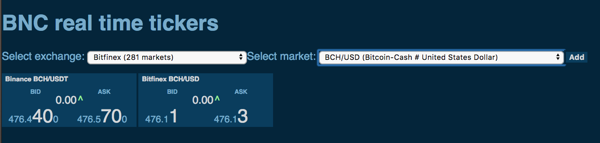

This project was bootstrapped with [Create React App](https://github.com/facebookincubator/create-react-app).

The style is based on an example [React JS FX Ticker](https://codepen.io/luanped/pen/RWpegv)

You can find the most recent version of this guide [here](https://github.com/facebookincubator/create-react-app/blob/master/packages/react-scripts/template/README.md).

- [Available Scripts](#available-scripts)
  - [npm start](#npm-start)
  - [npm test](#npm-test)
  - [npm run build](#npm-run-build)
  - [npm run eject](#npm-run-eject)
